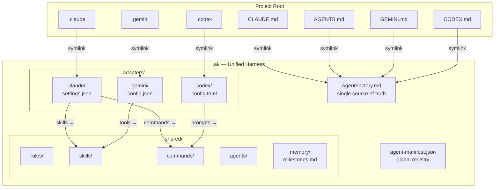
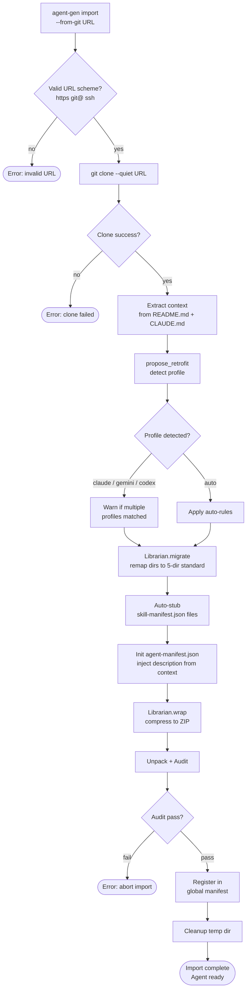
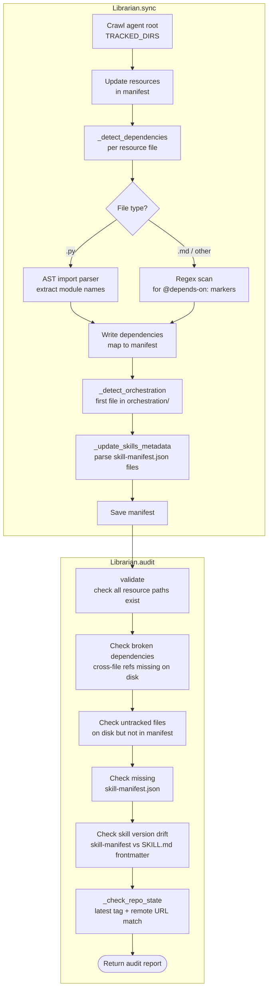
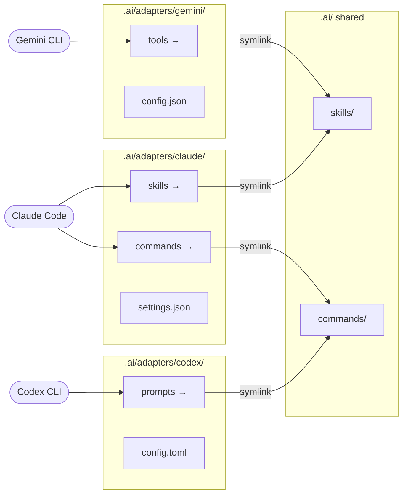
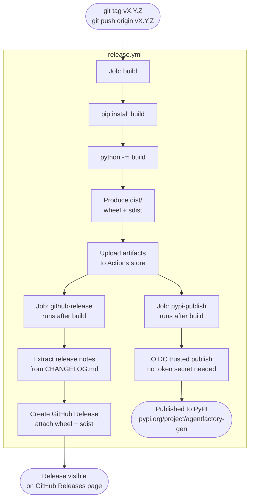
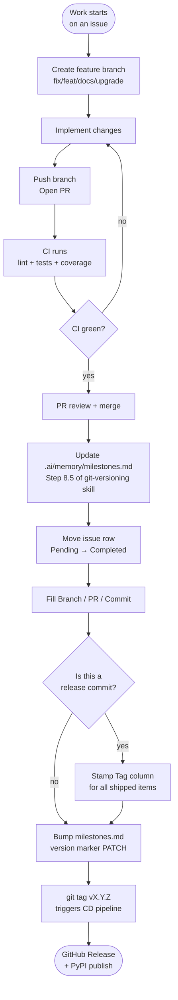

# AgentFactory
<!-- version: 2.5.0 -->

A lightweight Python CLI (`agent-gen`) for building, packaging, and deploying AI agents as portable, framework-agnostic units.

AgentFactory provides a **Unified AI Harness** — a single `.ai/` directory that lets Claude, Codex, and Gemini work on the same project simultaneously, sharing context without conflicts.

---

## Workflows

### 1. Overall Architecture



---

### 2. Agent Lifecycle

```mermaid
flowchart LR
    A([Start]) --> B[agent-gen deploy name]
    B --> C[Scaffold 5-dir structure\nskills commands docs\nscripts orchestration]
    C --> D[Init agent-manifest.json\nvia Librarian.init]

    D --> E[agent-gen describe\n--desc --plan]
    E --> F[Update manifest\nmetadata]

    F --> G[Develop\nadd skills commands docs]

    G --> H[agent-gen audit name]
    H --> I{Clean?}
    I -->|broken deps\nor missing files| G
    I -->|pass| J[agent-gen wrap name]

    J --> K[Librarian.sync\ncrawl disk → manifest]
    K --> L[Librarian.audit\nvalidate all paths]
    L --> M{Audit pass?}
    M -->|fail| G
    M -->|pass| N[Compress → name-vX.Y.Z.zip\nPortable Unit]

    N --> O[Share ZIP]
    O --> P[agent-gen import zip]
    P --> Q[Unpack into .ai/agents/name]
    Q --> R[Audit imported bundle]
    R --> S[Handshake\nregister in global manifest]
    S --> T([Agent ready])

    T --> U[agent-gen uninstall name]
    U --> V[Remove dir\nDeregister from manifest]
```



---

### 3. Remote Import Pipeline (`--from-git`)



---

### 4. Librarian Intelligence Layer



---

### 5. Multi-CLI Harness — Adapter Wiring



---

### 6. CI Pipeline (every push / PR)

```mermaid
flowchart TD
    A([Push or PR\nto dev / main]) --> B

    subgraph ci.yml
        B[Job: lint\nruff check src/] --> C{Lint pass?}
        C -->|fail| STOP1([Block — fix lint errors])
        C -->|pass| D

        D[Job: test matrix\nPython 3.11 + 3.12\nin parallel]
        D --> E[pip install -e '.[dev]']
        E --> F[pytest\n--cov=agent_gen\n--cov-fail-under=80]
        F --> G{Tests + Coverage\n≥ 80%?}
        G -->|fail| STOP2([Block — fix tests\nor add coverage])
        G -->|pass| H([Status check green\nTests + Coverage ✓])
    end

    H --> I{Is this a PR\nto dev?}
    I -->|yes| J[Branch protection gate\nrequires green status]
    J --> K([PR can be merged])
```

---

### 7. CD Pipeline (on version tag)



---

### 8. Traceability / Milestone Update Workflow



---

## Project Layout

```text
project/
├── CLAUDE.md  → .ai/AgentFactory.md   ← auto-loaded by Claude
├── AGENTS.md  → .ai/AgentFactory.md   ← auto-loaded by Codex  (same file)
├── GEMINI.md  → .ai/AgentFactory.md   ← auto-loaded by Gemini (same file)
├── CODEX.md   → .ai/AgentFactory.md   ← alias (same file)
├── .claude    → .ai/adapters/claude
├── .gemini    → .ai/adapters/gemini
├── .codex     → .ai/adapters/codex
└── .ai/
    ├── AgentFactory.md      ← single source of truth for all CLI instructions
    ├── agent-manifest.json  ← global agent registry
    ├── adapters/            ← per-CLI config + capability symlinks
    │   ├── claude/          settings.json, commands →, skills →
    │   ├── gemini/          config.json, tools → skills
    │   └── codex/           config.toml, prompts → commands
    ├── rules/               ← enforceable project constraints
    ├── commands/            ← Claude slash commands + Codex prompts (unified)
    ├── skills/              ← reusable deep-context workflows + Gemini tools
    ├── agents/              ← deployed agent directories
    ├── memory/              ← project state + milestones traceability matrix
    └── scripts/             ← harness utilities (harness-doctor.sh)
```

Each agent under `.ai/agents/<name>/` follows the **5-Directory Standard**:
`skills/` · `commands/` · `docs/` · `scripts/` · `orchestration/`

---

## Installation

```bash
pip install agentfactory-gen
```

Or install from source (editable):

```bash
git clone https://github.com/matheusmlopess/AgentFactory.git
cd AgentFactory
pip install -e ".[dev]"
```

Requires Python 3.11+.

---

## Quick Start

```bash
# 1. Initialise the harness in your project
agent-gen init

# 2. Deploy your first agent
agent-gen deploy my-agent

# 3. Set a description
agent-gen describe my-agent --desc "My first AgentFactory agent"

# 4. Audit integrity
agent-gen audit my-agent

# 5. Package into a Portable Unit
agent-gen wrap my-agent

# 6. Import a remote agent in one step
agent-gen import --from-git https://github.com/user/some-agent-repo
```

---

## CLI Reference

### Setup
```bash
agent-gen init                        # scaffold .ai/ harness + root symlinks
agent-gen init --project-root <path>  # target a different directory
```

### Agent Lifecycle
```bash
agent-gen deploy <name>               # scaffold a new agent
agent-gen describe <name> --desc "…"  # set agent description
agent-gen describe <name> --plan <p>  # set orchestration plan path
agent-gen audit <name>                # check for missing files, broken deps, version drift
agent-gen wrap <name>                 # compress agent into a shareable ZIP (Portable Unit)
agent-gen wrap <name> --out <dir>     # write ZIP to a specific directory
agent-gen import <zip>                # unpack ZIP and register agent
agent-gen import --from-git <url>     # clone repo, auto-retrofit, and import in one step
agent-gen uninstall <name>            # remove agent cleanly
```

### Skills & Intelligence
```bash
agent-gen import-skill <path>                  # import skill into root .ai/skills/
agent-gen import-skill <path> --to <agent>     # import into a specific agent
agent-gen retrofit <path>                      # convert Claude/Gemini/Codex layout to AgentFactory standard
```

### Global flag
```bash
agent-gen -q <command>               # suppress all informational output (quiet mode)
```

---

## Key Features

**`--from-git`** — Import any GitHub repo as an agent in one command:
```bash
agent-gen import --from-git https://github.com/user/repo
```
Reads `README.md` and `CLAUDE.md` to extract descriptions, auto-detects and applies the correct retrofit profile, creates `skill-manifest.json` stubs for sub-agents, and registers the result in `.ai/AgentFactory.md`.

**Librarian** (`src/agent_gen/librarian.py`) — core engine behind every lifecycle operation:
- Manifest integrity validation
- AST-based dependency detection (Python imports + `<!-- @depends-on: -->` annotations)
- Skill manifest auto-registration
- Audit: version drift, repo-state staleness, remote URL mismatch, path traversal protection

**Harness Doctor** (`.ai/scripts/harness-doctor.sh`) — live health check:
```bash
bash .ai/scripts/harness-doctor.sh        # full report
bash .ai/scripts/harness-doctor.sh --ci   # machine-readable + snapshot JSON
```
Exit codes: `0` clean · `1` warnings · `2` critical violations.

---

## CI/CD

| Trigger | Workflow | What runs |
|---|---|---|
| Push / PR to `dev` or `main` | `ci.yml` | ruff lint → pytest (3.11 + 3.12) → coverage ≥ 80% |
| `git tag v*` | `release.yml` | build wheel/sdist → GitHub Release → PyPI publish |

Branch protection on `dev` requires the **Tests + Coverage** status check to pass before any PR can merge.

See [`docs/CICD-WORKFLOW.md`](docs/CICD-WORKFLOW.md) for a full explanation of both pipelines.

---

## Architecture & Contributing

See `.ai/AgentFactory.md` for architecture, domain context, and project constraints.
See `docs/SPEC.md` for the technical specification (manifest schema, intelligence layer, lifecycle commands).
Contributions should follow the rules in `.ai/rules/`.

---

## Registered Agents
<!-- @agent-registry:start -->
- **test-agent**: Manual Description (See: `.ai/agents/test-agent/docs/CLAUDE.md`)
- **test-claude-agent**: AgentFactory-powered agent demonstrating a minimal Claude-native agent layout. (See: `.ai/agents/test-claude-agent/docs/CLAUDE.md`)
- **test-intel-agent**: AgentFactory-powered agent demonstrating intelligence-layer features: dependency detection and sk... (See: `.ai/agents/test-intel-agent/docs/CLAUDE.md`)
<!-- @agent-registry:end -->
