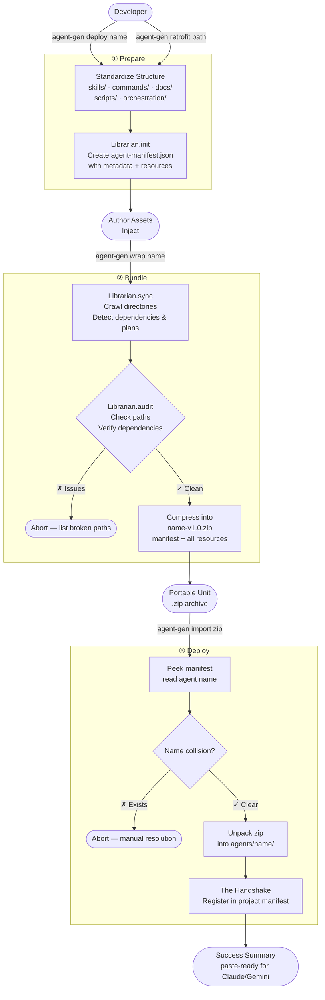

# AgentFactory

A lightweight CLI for building, packaging, and deploying AI agents as **Portable Units** — self-contained bundles of skills, commands, docs, scripts, and orchestration plans that can be wrapped, transported, and dropped into any environment.

The **Librarian** is the factory's infrastructure core: it owns the manifest, enforces integrity, and performs the Handshake on every import. It is also an **Intelligence Layer** that automatically detects dependencies and orchestration plans.

---

## Workflow



---

## The 5-Directory Standard

Every agent in the factory follows a standard structure that is fully interoperable with LLMs like Claude, Gemini, and Codex.

| Directory | Purpose |
|-----------|---------|
| `skills/` | High-level capabilities (e.g., `web-search.md`, `summarize/`). |
| `commands/`| Documentation for specific agent-available commands. |
| `docs/` | General documentation (e.g., `CLAUDE.md`, `GEMINI.md`). |
| `scripts/` | Executable code (Python, JS, etc.) that powers the agent. |
| `orchestration/` | Workflow definitions and agent entry points. |

---

## Command Reference

| Command | Description | Key Features |
|---------|-------------|--------------|
| `deploy <name>` | Scaffolds a new agent directory. | Creates 5 standard dirs + `.gitkeep` + initial manifest. |
| `retrofit <path>` | Ingests existing agent folders. | Detects Claude/Gemini/Codex profiles and maps to standard. |
| `describe <name>` | Updates agent metadata. | Set `--desc` for agent identity or `--plan` for entry points. |
| `audit <name>` | Checks for "Integrity Drift". | Reports broken paths, missing dependencies, and untracked files. |
| `wrap <name>` | Bundles agent for distribution. | Runs `sync` and `audit` before creating the portable .zip. |
| `import <zip>` | Unpacks and registers an agent. | Performs the "Handshake" to update the local project registry. |

---

## Intelligence & Interoperability

### Automated Dependency Tracking
The Librarian scans your files for explicit dependency annotations to build an automated graph:
```markdown
<!-- @depends-on: scripts/utils.py -->
```

### Retrofitting & Conversion
Bring existing Claude, Gemini, or Codex projects into the AgentFactory ecosystem with one command:
```bash
agent-gen retrofit path/to/existing-agent
```

---

## Installation

```bash
git clone <repo>
cd AgentFactory
pip install -e .
```

This exposes the `agent-gen` command globally.

---

## Requirements

- Python 3.11+
- `click >= 8.1`
- `git` in PATH (optional — used for `git_ref` capture)

## Registered Agents
<!-- @agent-registry:start -->
- **test-agent**: No description provided. (See: `agents/test-agent/docs/CLAUDE.md`)
<!-- @agent-registry:end -->
