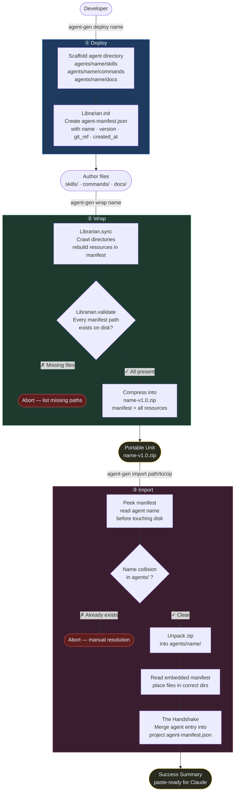

# AgentFactory

A lightweight CLI for building, packaging, and deploying AI agents as **Portable Units** — self-contained bundles of skills, commands, and docs that can be wrapped, transported, and dropped into any environment.

The **Librarian** is the factory's infrastructure core: it owns the manifest, enforces integrity, and performs the Handshake on every import.

---

## Workflow



---

## How It Works

The factory lifecycle has three stages, each owned by the **Librarian** — a Python class (`agent_gen/librarian.py`) that the CLI delegates to at every step.

### The Manifest

Every agent carries an `agent-manifest.json` as its identity card:

```json
{
  "name": "research-agent",
  "version": "1.0.0",
  "created_at": "2026-04-05T10:00:00+00:00",
  "git_ref": "a3f9c12",
  "synced_at": "2026-04-05T10:30:00+00:00",
  "resources": {
    "skills": ["skills/web-search.md", "skills/summarise.md"],
    "commands": ["commands/research.md"],
    "docs": ["docs/CLAUDE.md"]
  }
}
```

The manifest is the contract between the factory and the destination environment. The Librarian rebuilds it from disk on every `wrap` so it never drifts.

### ① Deploy — scaffold and initialise

`agent-gen deploy <name>` creates the directory tree and writes a blank manifest. No files are tracked yet — that happens at wrap time.

```
agents/research-agent/
├── agent-manifest.json   ← initialised by Librarian
├── skills/
├── commands/
└── docs/
```

### ② Wrap — validate and compress

`agent-gen wrap <name>` runs three Librarian operations in sequence:

| Step | What happens |
|------|-------------|
| `sync()` | Crawls `skills/`, `commands/`, `docs/` and rewrites `resources` in the manifest |
| `validate()` | Checks every listed path exists — aborts with a diff if any are missing |
| `wrap()` | Zips the manifest + all resources into `<name>-v<version>.zip` |

The zip is the **Portable Unit** — everything the agent needs, nothing it doesn't.

### ③ Import — unpack and the Handshake

`agent-gen import <path>` is the most critical operation:

1. **Peek** — reads the manifest inside the zip before touching the filesystem
2. **Collision check** — aborts if `agents/<name>/` already exists
3. **Unpack** — extracts files into the correct local directories
4. **The Handshake** — merges the agent's entry into the project's global `agent-manifest.json`, registering it as available without clobbering other agents
5. **Success Summary** — prints a paste-ready block for Claude

```
============================================================
Librarian: Import Complete.
  Added 2 skill(s), 1 command(s), and 1 doc(s) to your environment.
  You are now configured as the 'research-agent' agent.
  Check docs/CLAUDE.md for your new instructions.
============================================================
```

---

## Installation

```bash
git clone <repo>
cd AgentFactory
pip install -e .
```

This exposes the `agent-gen` command globally.

---

## Usage

### Deploy a new agent

```bash
agent-gen deploy research-agent
```

Creates `agents/research-agent/` with scaffolded directories and a fresh manifest.

### Author your agent

Drop files into the scaffolded directories:

```
agents/research-agent/
├── skills/web-search.md
├── skills/summarise.md
├── commands/research.md
└── docs/CLAUDE.md
```

### Wrap it into a Portable Unit

```bash
agent-gen wrap research-agent

# Write the archive somewhere specific
agent-gen wrap research-agent --out ~/exports
```

Produces `research-agent-v1.0.zip` — ready to share or deploy.

### Import into another project

```bash
cd ~/other-project
agent-gen import ~/exports/research-agent-v1.0.zip

# Specify a different project root for the Handshake
agent-gen import research-agent-v1.0.zip --project-root /path/to/project
```

---

## Project Structure

```
AgentFactory/
├── pyproject.toml          # package config — entry point: agent-gen
├── agent_gen/
│   ├── __init__.py
│   ├── librarian.py        # Librarian class: init · sync · validate · wrap · unpack · handshake
│   └── cli.py              # Click CLI: deploy · wrap · import
└── .github/
    └── ISSUES/
        └── librarian-feature.md   # full GitHub Issue spec
```

---

## Requirements

- Python 3.11+
- `click >= 8.1`
- `git` in PATH (optional — used for `git_ref` capture; falls back to `"untracked"`)
