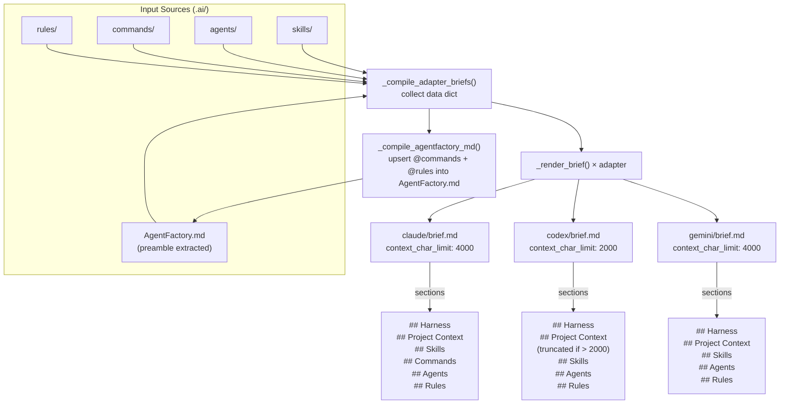
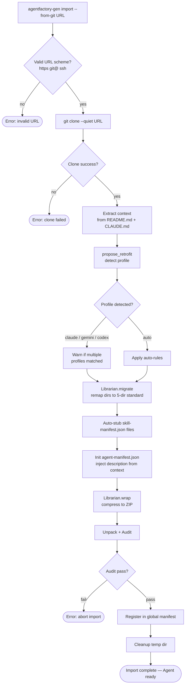
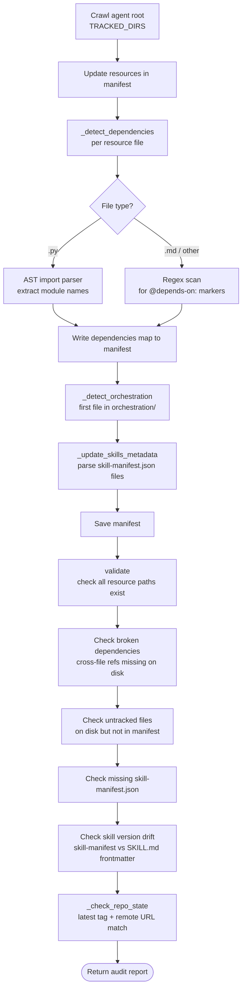
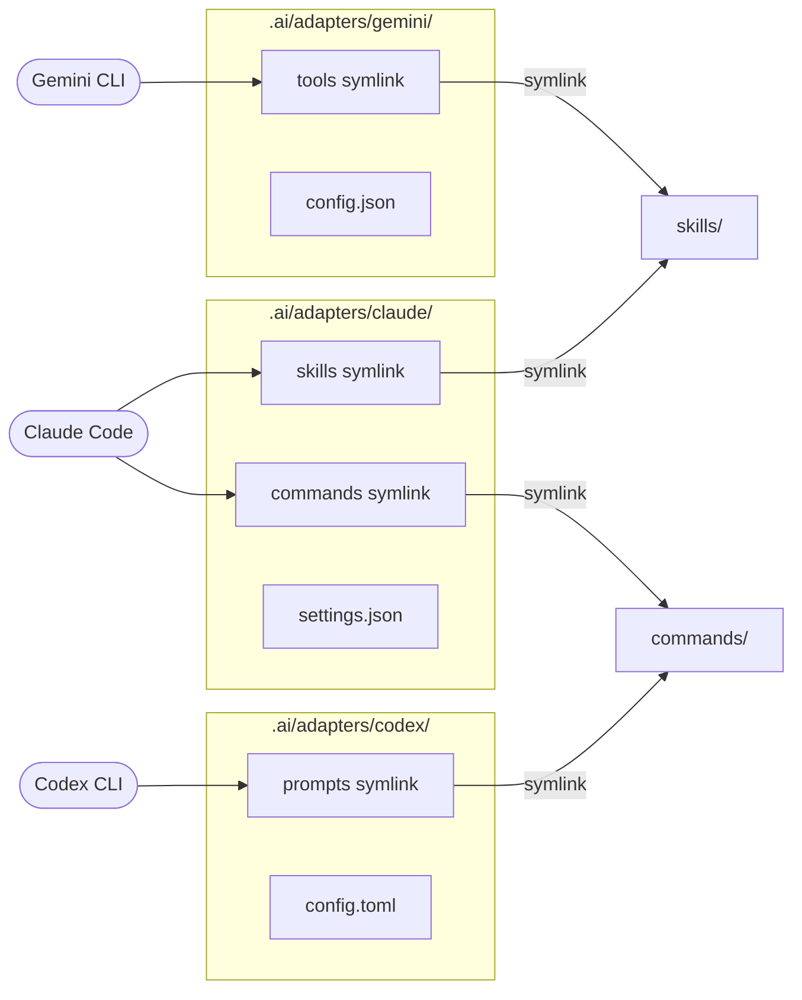
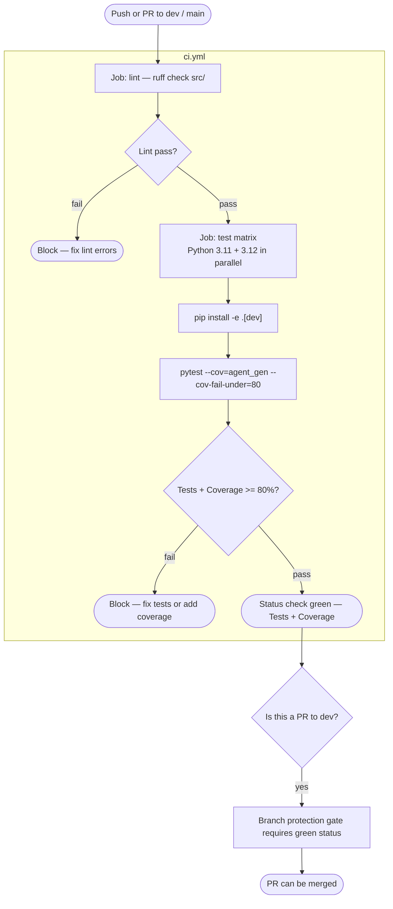
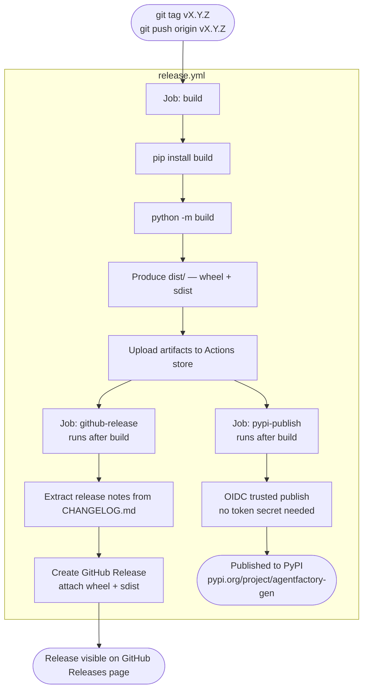
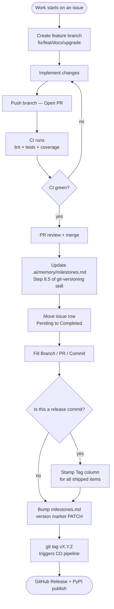

# AgentFactory — Workflow Diagrams
<!-- version: 1.1.0 -->

Architecture, lifecycle, and pipeline diagrams for AgentFactory.
See [README](../README.md) for installation and quick start.

---

## 1. Overall Architecture

```mermaid
graph TD
    subgraph root["Project Root"]
        CM[CLAUDE.md]
        AM["AGENTS.md / CODEX.md"]
        GM[GEMINI.md]
        CL[.claude]
        GE[.gemini]
        CD[.codex]
    end

    subgraph harness[".ai/ — Unified Harness"]
        AF["AgentFactory.md (master compiled brief)"]
        MF["agent-manifest.json (global registry)"]

        subgraph adapters["adapters/"]
            ACA_B["claude/brief.md (compiled)"]
            AGE_B["gemini/brief.md (compiled)"]
            ACO_B["codex/brief.md (compiled)"]
        end

        subgraph shared["shared/"]
            RU[rules/]
            SK[skills/]
            CMD[commands/]
            AG[agents/]
            MEM["memory/ — milestones.md"]
        end
    end

    CM -->|symlink| ACA_B
    AM -->|symlink| ACO_B
    GM -->|symlink| AGE_B
    CL -->|symlink to adapter dir| adapters
    GE -->|symlink to adapter dir| adapters
    CD -->|symlink to adapter dir| adapters

    RU -->|compiled into| ACA_B
    RU -->|compiled into| ACO_B
    RU -->|compiled into| AGE_B
    CMD -->|compiled into| ACA_B
    SK -->|compiled into| ACA_B
    SK -->|compiled into| ACO_B
    SK -->|compiled into| AGE_B
    AF -->|preamble injected into| ACA_B
    AF -->|preamble injected into| ACO_B
    AF -->|preamble injected into| AGE_B
```

> **Note:** Root files (`CLAUDE.md`, `AGENTS.md`, `GEMINI.md`) are symlinks to
> per-adapter compiled briefs — **not** to `AgentFactory.md` directly. This is the
> FormatSwitch model introduced in #96. `AgentFactory.md` is a full master compiled
> brief that is also the preamble source for every adapter brief.

---

## 2. Brief Compilation Pipeline (`agentfactory-gen brief`)

---

## 3. Agent Lifecycle

```mermaid
flowchart LR
    A([Start]) --> B["agentfactory-gen deploy name"]
    B --> C["Scaffold 5-dir structure\nskills commands docs\nscripts orchestration"]
    C --> D["Init agent-manifest.json\nvia Librarian.init"]

    D --> E["agentfactory-gen describe\n--desc --plan"]
    E --> F["Update manifest metadata"]

    F --> G["Develop\nadd skills commands docs"]

    G --> H["agentfactory-gen audit name"]
    H --> I{Clean?}
    I -->|"broken deps or missing files"| G
    I -->|pass| J["agentfactory-gen wrap name"]

    J --> K["Librarian.sync\ncrawl disk to manifest"]
    K --> L["Librarian.audit\nvalidate all paths"]
    L --> M{Audit pass?}
    M -->|fail| G
    M -->|pass| N["Compress to name-vX.Y.Z.zip\nPortable Unit"]

    N --> O[Share ZIP]
    O --> P["agentfactory-gen import zip"]
    P --> Q["Unpack into .ai/agents/name"]
    Q --> R[Audit imported bundle]
    R --> S["Register in global manifest"]
    S --> T([Agent ready])

    T --> U["agentfactory-gen uninstall name"]
    U --> V["Remove dir\nDeregister from manifest"]
```

---

## 4. Remote Import Pipeline (`--from-git`)

---

## 5. Librarian Intelligence Layer

---

## 6. Multi-CLI Harness — Adapter Wiring

---

## 7. CI Pipeline (every push / PR)

---

## 8. CD Pipeline (on version tag)

---

## 9. Traceability / Milestone Update Workflow

